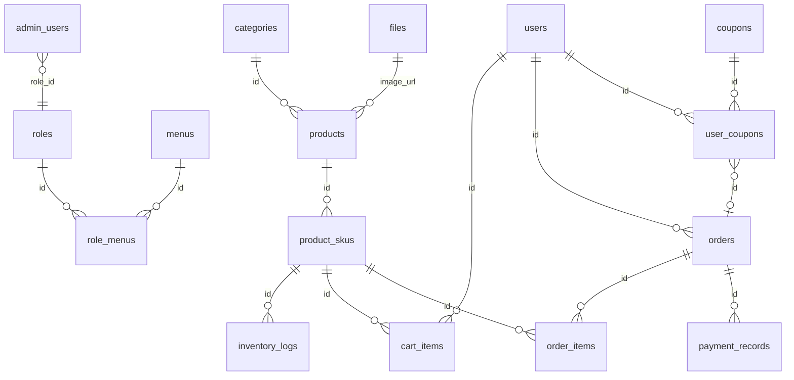

# Owl Coffee 数据库设计文档

> 文档类型：数据库设计  
> 适用项目：Owl Coffee 后台系统 / 小程序 / 官网  
> 当前版本：v1 MVP  
> 数据库：MySQL  
> 关联文档：`docs/project-overview.md`、`docs/admin-prd.md`、`docs/miniapp-prd.md`、`docs/website-prd.md`、`docs/api-spec.md`

---

## 1. 文档说明

本文档用于定义 Owl Coffee 三端 MVP 的数据库设计，覆盖后台、小程序、官网首版所需的数据表、字段、索引、关联关系、状态枚举、初始化数据和关键表 SQL 示例。

数据库设计与 `docs/api-spec.md` 保持一致：

- 接口字段使用 `camelCase`
- 数据库字段使用 `snake_case`
- 主键使用带业务前缀的 `nanoid` 字符串
- 订单额外提供展示编号 `order_no`
- 删除使用软删除字段 `deleted_at`

---

## 2. 数据库总规范

| 项 | 规范 |
|---|---|
| 数据库 | MySQL |
| 字符集 | `utf8mb4` |
| 排序规则 | `utf8mb4_0900_ai_ci` |
| 表名前缀 | 不加统一前缀 |
| 表名风格 | 复数或业务语义名 |
| 字段风格 | `snake_case` |
| 主键类型 | `VARCHAR(32)` |
| 金额类型 | `DECIMAL(10,2)` |
| 删除策略 | 软删除 |

说明：

- 本文档不使用自增 ID。
- 本文档不设计多门店、加盟、会员等级、积分、余额和外送相关表。
- 首版不接真实微信支付，但保留 `payment_records` 作为后续扩展基础。

---

## 3. 命名规范

### 3.1 表命名

| 类型 | 示例 |
|---|---|
| 商品 | `products` |
| 商品 SKU | `product_skus` |
| 订单 | `orders` |
| 订单明细 | `order_items` |
| 用户优惠券 | `user_coupons` |

### 3.2 字段命名

接口到数据库字段映射示例：

| 接口字段 | 数据库字段 |
|---|---|
| `orderStatus` | `order_status` |
| `paymentStatus` | `payment_status` |
| `createdAt` | `created_at` |
| `pickupCode` | `pickup_code` |
| `warningStock` | `warning_stock` |

### 3.3 ID 命名

| 资源 | ID 示例 |
|---|---|
| 商品 | `prod_xxx` |
| 分类 | `cat_xxx` |
| SKU | `sku_xxx` |
| 订单 | `order_xxx` |
| 用户 | `user_xxx` |
| 优惠券 | `coupon_xxx` |
| 角色 | `role_xxx` |
| 文件 | `file_xxx` |

---

## 4. 通用字段

业务表默认包含以下字段：

| 字段 | 类型 | 说明 |
|---|---|---|
| `id` | `VARCHAR(32)` | 主键，带前缀 nanoid |
| `created_at` | `DATETIME(3)` | 创建时间 |
| `updated_at` | `DATETIME(3)` | 更新时间 |
| `deleted_at` | `DATETIME(3) NULL` | 软删除时间 |
| `created_by` | `VARCHAR(32) NULL` | 创建人 |
| `updated_by` | `VARCHAR(32) NULL` | 更新人 |

说明：

- 小程序用户侧自动产生的数据，`created_by` / `updated_by` 可为空或记录用户 ID。
- 日志类表可只保留必要时间字段，不强制完整审计字段。
- `deleted_at IS NULL` 表示数据有效。

---

## 5. ER 图



---

## 6. 表清单

| 分组 | 表名 | 说明 |
|---|---|---|
| 账号与权限 | `admin_users` | 后台管理员和店员账号 |
| 账号与权限 | `roles` | 后台角色 |
| 账号与权限 | `menus` | 后台菜单 |
| 账号与权限 | `role_menus` | 角色菜单关系 |
| 账号与权限 | `auth_refresh_tokens` | Refresh Token |
| 用户与小程序 | `users` | 小程序用户 |
| 用户与小程序 | `cart_items` | 小程序购物车 |
| 商品与库存 | `categories` | 商品分类 |
| 商品与库存 | `products` | 商品 |
| 商品与库存 | `product_skus` | 商品 SKU |
| 商品与库存 | `inventory_logs` | 库存流水 |
| 订单与支付 | `orders` | 订单 |
| 订单与支付 | `order_items` | 订单明细 |
| 订单与支付 | `payment_records` | 支付记录 |
| 优惠券 | `coupons` | 优惠券模板 |
| 优惠券 | `user_coupons` | 用户优惠券 |
| 系统与内容 | `store_settings` | 单店配置 |
| 系统与内容 | `files` | 上传文件 |
| 日志 | `admin_login_logs` | 后台登录日志 |
| 日志 | `admin_operation_logs` | 后台操作日志 |

---

## 7. 表结构设计

## 7.1 `admin_users`

| 字段 | 类型 | 约束 | 说明 |
|---|---|---|---|
| `id` | `VARCHAR(32)` | PK | 管理员 ID |
| `account` | `VARCHAR(64)` | UNIQUE, NOT NULL | 登录账号 |
| `password_hash` | `VARCHAR(255)` | NOT NULL | 密码哈希 |
| `name` | `VARCHAR(64)` | NOT NULL | 显示名称 |
| `phone` | `VARCHAR(32)` | NULL | 手机号 |
| `avatar_url` | `VARCHAR(512)` | NULL | 头像 |
| `role_id` | `VARCHAR(32)` | NOT NULL, INDEX | 角色 ID |
| `status` | `VARCHAR(32)` | NOT NULL | `enabled` / `disabled` |
| `last_login_at` | `DATETIME(3)` | NULL | 最近登录时间 |
| `created_at` | `DATETIME(3)` | NOT NULL | 创建时间 |
| `updated_at` | `DATETIME(3)` | NOT NULL | 更新时间 |
| `deleted_at` | `DATETIME(3)` | NULL | 软删除时间 |
| `created_by` | `VARCHAR(32)` | NULL | 创建人 |
| `updated_by` | `VARCHAR(32)` | NULL | 更新人 |

索引：

- `uk_admin_users_account (account)`
- `idx_admin_users_role_id (role_id)`
- `idx_admin_users_status (status)`

---

## 7.2 `roles`

| 字段 | 类型 | 约束 | 说明 |
|---|---|---|---|
| `id` | `VARCHAR(32)` | PK | 角色 ID |
| `name` | `VARCHAR(64)` | NOT NULL | 角色名称 |
| `code` | `VARCHAR(64)` | UNIQUE, NOT NULL | 角色编码 |
| `description` | `VARCHAR(255)` | NULL | 描述 |
| `status` | `VARCHAR(32)` | NOT NULL | `enabled` / `disabled` |
| `created_at` | `DATETIME(3)` | NOT NULL | 创建时间 |
| `updated_at` | `DATETIME(3)` | NOT NULL | 更新时间 |
| `deleted_at` | `DATETIME(3)` | NULL | 软删除时间 |
| `created_by` | `VARCHAR(32)` | NULL | 创建人 |
| `updated_by` | `VARCHAR(32)` | NULL | 更新人 |

---

## 7.3 `menus`

| 字段 | 类型 | 约束 | 说明 |
|---|---|---|---|
| `id` | `VARCHAR(32)` | PK | 菜单 ID，可使用业务编码 |
| `parent_id` | `VARCHAR(32)` | NULL, INDEX | 父级菜单 |
| `name` | `VARCHAR(64)` | NOT NULL | 菜单名称 |
| `path` | `VARCHAR(255)` | NOT NULL | 前端路由 |
| `icon` | `VARCHAR(64)` | NULL | 图标 |
| `sort` | `INT` | NOT NULL DEFAULT 0 | 排序 |
| `status` | `VARCHAR(32)` | NOT NULL | `enabled` / `disabled` |
| `meta` | `JSON` | NULL | 扩展配置 |
| `created_at` | `DATETIME(3)` | NOT NULL | 创建时间 |
| `updated_at` | `DATETIME(3)` | NOT NULL | 更新时间 |
| `deleted_at` | `DATETIME(3)` | NULL | 软删除时间 |

JSON 使用说明：`meta` 可保存标题、缓存、隐藏等前端扩展配置。

---

## 7.4 `role_menus`

| 字段 | 类型 | 约束 | 说明 |
|---|---|---|---|
| `role_id` | `VARCHAR(32)` | PK, INDEX | 角色 ID |
| `menu_id` | `VARCHAR(32)` | PK, INDEX | 菜单 ID |
| `created_at` | `DATETIME(3)` | NOT NULL | 创建时间 |

说明：首版只做角色菜单权限，不设计按钮权限表。

---

## 7.5 `auth_refresh_tokens`

| 字段 | 类型 | 约束 | 说明 |
|---|---|---|---|
| `id` | `VARCHAR(32)` | PK | Token 记录 ID |
| `subject_id` | `VARCHAR(32)` | NOT NULL, INDEX | 用户或管理员 ID |
| `subject_type` | `VARCHAR(32)` | NOT NULL | `admin` / `app_user` |
| `refresh_token_hash` | `VARCHAR(255)` | NOT NULL | Refresh Token 哈希 |
| `expires_at` | `DATETIME(3)` | NOT NULL | 过期时间 |
| `revoked_at` | `DATETIME(3)` | NULL | 失效时间 |
| `created_at` | `DATETIME(3)` | NOT NULL | 创建时间 |

---

## 7.6 `users`

| 字段 | 类型 | 约束 | 说明 |
|---|---|---|---|
| `id` | `VARCHAR(32)` | PK | 用户 ID |
| `openid` | `VARCHAR(128)` | UNIQUE, NOT NULL | 微信 openid |
| `unionid` | `VARCHAR(128)` | NULL | 微信 unionid |
| `nickname` | `VARCHAR(64)` | NULL | 昵称 |
| `avatar_url` | `VARCHAR(512)` | NULL | 头像 |
| `phone` | `VARCHAR(32)` | NULL, INDEX | 手机号 |
| `phone_bound` | `TINYINT(1)` | NOT NULL DEFAULT 0 | 是否绑定手机号 |
| `user_status` | `VARCHAR(32)` | NOT NULL | `normal` / `disabled` |
| `order_count` | `INT` | NOT NULL DEFAULT 0 | 订单数冗余 |
| `total_consume_amount` | `DECIMAL(10,2)` | NOT NULL DEFAULT 0.00 | 累计消费金额 |
| `last_order_at` | `DATETIME(3)` | NULL | 最近下单时间 |
| `created_at` | `DATETIME(3)` | NOT NULL | 创建时间 |
| `updated_at` | `DATETIME(3)` | NOT NULL | 更新时间 |
| `deleted_at` | `DATETIME(3)` | NULL | 软删除时间 |
| `created_by` | `VARCHAR(32)` | NULL | 创建人 |
| `updated_by` | `VARCHAR(32)` | NULL | 更新人 |

索引：

- `uk_users_openid (openid)`
- `idx_users_phone (phone)`
- `idx_users_status (user_status)`

---

## 7.7 `categories`

| 字段 | 类型 | 约束 | 说明 |
|---|---|---|---|
| `id` | `VARCHAR(32)` | PK | 分类 ID |
| `name` | `VARCHAR(64)` | NOT NULL | 分类名称 |
| `sort` | `INT` | NOT NULL DEFAULT 0 | 排序 |
| `status` | `VARCHAR(32)` | NOT NULL | `enabled` / `disabled` |
| `created_at` | `DATETIME(3)` | NOT NULL | 创建时间 |
| `updated_at` | `DATETIME(3)` | NOT NULL | 更新时间 |
| `deleted_at` | `DATETIME(3)` | NULL | 软删除时间 |
| `created_by` | `VARCHAR(32)` | NULL | 创建人 |
| `updated_by` | `VARCHAR(32)` | NULL | 更新人 |

索引：

- `idx_categories_status_sort (status, sort)`

---

## 7.8 `products`

| 字段 | 类型 | 约束 | 说明 |
|---|---|---|---|
| `id` | `VARCHAR(32)` | PK | 商品 ID |
| `category_id` | `VARCHAR(32)` | NOT NULL, INDEX | 分类 ID |
| `name` | `VARCHAR(128)` | NOT NULL | 商品名称 |
| `image_url` | `VARCHAR(512)` | NULL | 商品图片 |
| `description` | `TEXT` | NULL | 商品描述 |
| `product_status` | `VARCHAR(32)` | NOT NULL | `on_sale` / `off_sale` |
| `sort` | `INT` | NOT NULL DEFAULT 0 | 排序 |
| `is_recommended` | `TINYINT(1)` | NOT NULL DEFAULT 0 | 官网/小程序推荐 |
| `created_at` | `DATETIME(3)` | NOT NULL | 创建时间 |
| `updated_at` | `DATETIME(3)` | NOT NULL | 更新时间 |
| `deleted_at` | `DATETIME(3)` | NULL | 软删除时间 |
| `created_by` | `VARCHAR(32)` | NULL | 创建人 |
| `updated_by` | `VARCHAR(32)` | NULL | 更新人 |

索引：

- `idx_products_category_id (category_id)`
- `idx_products_status_sort (product_status, sort)`
- `idx_products_recommended (is_recommended)`

---

## 7.9 `product_skus`

| 字段 | 类型 | 约束 | 说明 |
|---|---|---|---|
| `id` | `VARCHAR(32)` | PK | SKU ID |
| `product_id` | `VARCHAR(32)` | NOT NULL, INDEX | 商品 ID |
| `sku_code` | `VARCHAR(64)` | UNIQUE, NOT NULL | SKU 编码 |
| `temperature` | `VARCHAR(32)` | NOT NULL | 温度 |
| `cup_size` | `VARCHAR(32)` | NOT NULL | 杯型 |
| `sugar_level` | `VARCHAR(32)` | NOT NULL | 糖度 |
| `price` | `DECIMAL(10,2)` | NOT NULL | 售价 |
| `stock` | `INT` | NOT NULL DEFAULT 0 | 当前库存 |
| `warning_stock` | `INT` | NOT NULL DEFAULT 0 | 预警库存 |
| `sku_status` | `VARCHAR(32)` | NOT NULL | `enabled` / `disabled` |
| `created_at` | `DATETIME(3)` | NOT NULL | 创建时间 |
| `updated_at` | `DATETIME(3)` | NOT NULL | 更新时间 |
| `deleted_at` | `DATETIME(3)` | NULL | 软删除时间 |
| `created_by` | `VARCHAR(32)` | NULL | 创建人 |
| `updated_by` | `VARCHAR(32)` | NULL | 更新人 |

索引：

- `uk_product_skus_code (sku_code)`
- `idx_product_skus_product_id (product_id)`
- `idx_product_skus_status_stock (sku_status, stock)`

---

## 7.10 `inventory_logs`

| 字段 | 类型 | 约束 | 说明 |
|---|---|---|---|
| `id` | `VARCHAR(32)` | PK | 库存流水 ID |
| `sku_id` | `VARCHAR(32)` | NOT NULL, INDEX | SKU ID |
| `change_type` | `VARCHAR(32)` | NOT NULL | `in` / `out` / `check` / `order_deduct` / `order_refund` |
| `change_quantity` | `INT` | NOT NULL | 变化数量，出库和扣减可为负数 |
| `before_stock` | `INT` | NOT NULL | 变化前库存 |
| `after_stock` | `INT` | NOT NULL | 变化后库存 |
| `related_order_id` | `VARCHAR(32)` | NULL, INDEX | 关联订单 |
| `reason` | `VARCHAR(255)` | NULL | 原因 |
| `created_at` | `DATETIME(3)` | NOT NULL | 创建时间 |
| `created_by` | `VARCHAR(32)` | NULL | 操作人 |

说明：模拟支付成功扣减库存时必须写入 `order_deduct` 流水，后台退款回补库存时必须写入 `order_refund` 流水。

---

## 7.11 `cart_items`

| 字段 | 类型 | 约束 | 说明 |
|---|---|---|---|
| `id` | `VARCHAR(32)` | PK | 购物车项 ID |
| `user_id` | `VARCHAR(32)` | NOT NULL, INDEX | 用户 ID |
| `sku_id` | `VARCHAR(32)` | NOT NULL, INDEX | SKU ID |
| `quantity` | `INT` | NOT NULL | 数量 |
| `created_at` | `DATETIME(3)` | NOT NULL | 创建时间 |
| `updated_at` | `DATETIME(3)` | NOT NULL | 更新时间 |

索引：

- `uk_cart_items_user_sku (user_id, sku_id)`

---

## 7.12 `orders`

| 字段 | 类型 | 约束 | 说明 |
|---|---|---|---|
| `id` | `VARCHAR(32)` | PK | 订单 ID |
| `order_no` | `VARCHAR(32)` | UNIQUE, NOT NULL | 展示订单号 |
| `user_id` | `VARCHAR(32)` | NULL, INDEX | 小程序用户 ID |
| `user_name` | `VARCHAR(64)` | NULL | 用户名或补单联系人 |
| `phone` | `VARCHAR(32)` | NULL | 手机号 |
| `order_source` | `VARCHAR(32)` | NOT NULL | `app` / `admin` |
| `order_status` | `VARCHAR(32)` | NOT NULL | 订单状态 |
| `payment_status` | `VARCHAR(32)` | NOT NULL | 支付状态 |
| `payment_method` | `VARCHAR(32)` | NOT NULL DEFAULT 'mock' | 支付方式 |
| `total_amount` | `DECIMAL(10,2)` | NOT NULL | 商品金额 |
| `discount_amount` | `DECIMAL(10,2)` | NOT NULL DEFAULT 0.00 | 优惠金额 |
| `pay_amount` | `DECIMAL(10,2)` | NOT NULL | 实付金额 |
| `user_coupon_id` | `VARCHAR(32)` | NULL, INDEX | 用户优惠券 |
| `pickup_code` | `VARCHAR(32)` | NULL, INDEX | 取餐码 |
| `remark` | `VARCHAR(500)` | NULL | 用户或店员备注 |
| `paid_at` | `DATETIME(3)` | NULL | 支付时间 |
| `making_at` | `DATETIME(3)` | NULL | 制作中时间 |
| `ready_at` | `DATETIME(3)` | NULL | 待取餐时间 |
| `completed_at` | `DATETIME(3)` | NULL | 完成时间 |
| `cancelled_at` | `DATETIME(3)` | NULL | 取消时间 |
| `refunded_at` | `DATETIME(3)` | NULL | 退款时间 |
| `created_at` | `DATETIME(3)` | NOT NULL | 创建时间 |
| `updated_at` | `DATETIME(3)` | NOT NULL | 更新时间 |
| `deleted_at` | `DATETIME(3)` | NULL | 软删除时间 |
| `created_by` | `VARCHAR(32)` | NULL | 创建人 |
| `updated_by` | `VARCHAR(32)` | NULL | 更新人 |

索引：

- `uk_orders_order_no (order_no)`
- `idx_orders_user_id (user_id)`
- `idx_orders_status_time (order_status, created_at)`
- `idx_orders_payment_status (payment_status)`
- `idx_orders_pickup_code (pickup_code)`

---

## 7.13 `order_items`

| 字段 | 类型 | 约束 | 说明 |
|---|---|---|---|
| `id` | `VARCHAR(32)` | PK | 订单明细 ID |
| `order_id` | `VARCHAR(32)` | NOT NULL, INDEX | 订单 ID |
| `product_id` | `VARCHAR(32)` | NOT NULL | 商品 ID 快照 |
| `sku_id` | `VARCHAR(32)` | NOT NULL | SKU ID 快照 |
| `product_name` | `VARCHAR(128)` | NOT NULL | 商品名称快照 |
| `image_url` | `VARCHAR(512)` | NULL | 商品图片快照 |
| `temperature` | `VARCHAR(32)` | NOT NULL | 温度快照 |
| `cup_size` | `VARCHAR(32)` | NOT NULL | 杯型快照 |
| `sugar_level` | `VARCHAR(32)` | NOT NULL | 糖度快照 |
| `unit_price` | `DECIMAL(10,2)` | NOT NULL | 下单单价 |
| `quantity` | `INT` | NOT NULL | 数量 |
| `subtotal_amount` | `DECIMAL(10,2)` | NOT NULL | 小计 |
| `created_at` | `DATETIME(3)` | NOT NULL | 创建时间 |

说明：订单明细必须保存商品和 SKU 快照，避免商品后续编辑影响历史订单。

---

## 7.14 `payment_records`

| 字段 | 类型 | 约束 | 说明 |
|---|---|---|---|
| `id` | `VARCHAR(32)` | PK | 支付记录 ID |
| `order_id` | `VARCHAR(32)` | NOT NULL, INDEX | 订单 ID |
| `payment_no` | `VARCHAR(64)` | UNIQUE, NOT NULL | 支付流水号 |
| `payment_method` | `VARCHAR(32)` | NOT NULL | `mock` |
| `payment_status` | `VARCHAR(32)` | NOT NULL | `success` / `fail` |
| `amount` | `DECIMAL(10,2)` | NOT NULL | 支付金额 |
| `raw_response` | `JSON` | NULL | 模拟支付或后续真实支付响应 |
| `paid_at` | `DATETIME(3)` | NULL | 支付成功时间 |
| `created_at` | `DATETIME(3)` | NOT NULL | 创建时间 |

---

## 7.15 `coupons`

| 字段 | 类型 | 约束 | 说明 |
|---|---|---|---|
| `id` | `VARCHAR(32)` | PK | 优惠券模板 ID |
| `name` | `VARCHAR(128)` | NOT NULL | 优惠券名称 |
| `coupon_type` | `VARCHAR(32)` | NOT NULL | `discount_amount` / `discount_rate` |
| `threshold_amount` | `DECIMAL(10,2)` | NOT NULL DEFAULT 0.00 | 使用门槛 |
| `discount_amount` | `DECIMAL(10,2)` | NULL | 满减金额 |
| `discount_rate` | `DECIMAL(5,2)` | NULL | 折扣比例 |
| `total_quantity` | `INT` | NOT NULL | 发放数量 |
| `used_quantity` | `INT` | NOT NULL DEFAULT 0 | 已使用数量 |
| `limit_per_user` | `INT` | NOT NULL DEFAULT 1 | 每人限领 |
| `valid_start_at` | `DATETIME(3)` | NOT NULL | 有效期开始 |
| `valid_end_at` | `DATETIME(3)` | NOT NULL | 有效期结束 |
| `coupon_status` | `VARCHAR(32)` | NOT NULL | 状态 |
| `created_at` | `DATETIME(3)` | NOT NULL | 创建时间 |
| `updated_at` | `DATETIME(3)` | NOT NULL | 更新时间 |
| `deleted_at` | `DATETIME(3)` | NULL | 软删除时间 |
| `created_by` | `VARCHAR(32)` | NULL | 创建人 |
| `updated_by` | `VARCHAR(32)` | NULL | 更新人 |

---

## 7.16 `user_coupons`

| 字段 | 类型 | 约束 | 说明 |
|---|---|---|---|
| `id` | `VARCHAR(32)` | PK | 用户优惠券 ID |
| `user_id` | `VARCHAR(32)` | NOT NULL, INDEX | 用户 ID |
| `coupon_id` | `VARCHAR(32)` | NOT NULL, INDEX | 优惠券模板 ID |
| `coupon_status` | `VARCHAR(32)` | NOT NULL | `available` / `used` / `expired` |
| `received_at` | `DATETIME(3)` | NOT NULL | 领取时间 |
| `used_at` | `DATETIME(3)` | NULL | 使用时间 |
| `order_id` | `VARCHAR(32)` | NULL, INDEX | 使用订单 |
| `created_at` | `DATETIME(3)` | NOT NULL | 创建时间 |
| `updated_at` | `DATETIME(3)` | NOT NULL | 更新时间 |

---

## 7.17 `store_settings`

| 字段 | 类型 | 约束 | 说明 |
|---|---|---|---|
| `id` | `VARCHAR(32)` | PK | 配置 ID |
| `store_name` | `VARCHAR(128)` | NOT NULL | 门店名称 |
| `address` | `VARCHAR(255)` | NOT NULL | 地址 |
| `business_hours` | `VARCHAR(128)` | NOT NULL | 营业时间 |
| `phone` | `VARCHAR(32)` | NOT NULL | 联系电话 |
| `pickup_notice` | `VARCHAR(500)` | NULL | 取餐说明 |
| `map_info` | `JSON` | NULL | 地图信息 |
| `miniapp_qrcode_url` | `VARCHAR(512)` | NULL | 小程序二维码 |
| `created_at` | `DATETIME(3)` | NOT NULL | 创建时间 |
| `updated_at` | `DATETIME(3)` | NOT NULL | 更新时间 |
| `updated_by` | `VARCHAR(32)` | NULL | 更新人 |

说明：首版单店经营，只保留一条有效配置。

---

## 7.18 `files`

| 字段 | 类型 | 约束 | 说明 |
|---|---|---|---|
| `id` | `VARCHAR(32)` | PK | 文件 ID |
| `biz_type` | `VARCHAR(32)` | NOT NULL | `product` / `logo` / `store` / `website` |
| `name` | `VARCHAR(255)` | NOT NULL | 原始文件名 |
| `url` | `VARCHAR(512)` | NOT NULL | 文件访问地址 |
| `size` | `BIGINT` | NOT NULL | 文件大小 |
| `mime_type` | `VARCHAR(128)` | NOT NULL | MIME 类型 |
| `storage_provider` | `VARCHAR(64)` | NULL | 对象存储服务商，待补充 |
| `object_key` | `VARCHAR(255)` | NULL | 对象存储 key |
| `created_at` | `DATETIME(3)` | NOT NULL | 创建时间 |
| `created_by` | `VARCHAR(32)` | NULL | 上传人 |

---

## 7.19 `admin_login_logs`

| 字段 | 类型 | 约束 | 说明 |
|---|---|---|---|
| `id` | `VARCHAR(32)` | PK | 日志 ID |
| `admin_user_id` | `VARCHAR(32)` | NULL, INDEX | 管理员 ID |
| `account` | `VARCHAR(64)` | NOT NULL | 登录账号 |
| `login_result` | `VARCHAR(32)` | NOT NULL | `success` / `fail` |
| `ip` | `VARCHAR(64)` | NULL | IP |
| `user_agent` | `VARCHAR(512)` | NULL | 浏览器信息 |
| `message` | `VARCHAR(255)` | NULL | 说明 |
| `created_at` | `DATETIME(3)` | NOT NULL | 创建时间 |

---

## 7.20 `admin_operation_logs`

| 字段 | 类型 | 约束 | 说明 |
|---|---|---|---|
| `id` | `VARCHAR(32)` | PK | 日志 ID |
| `admin_user_id` | `VARCHAR(32)` | NULL, INDEX | 操作人 |
| `module` | `VARCHAR(64)` | NOT NULL | 模块 |
| `action` | `VARCHAR(64)` | NOT NULL | 操作 |
| `target_id` | `VARCHAR(32)` | NULL | 目标 ID |
| `summary` | `VARCHAR(255)` | NULL | 操作摘要 |
| `ip` | `VARCHAR(64)` | NULL | IP |
| `created_at` | `DATETIME(3)` | NOT NULL | 创建时间 |

---

## 8. 状态枚举

| 枚举 | 值 |
|---|---|
| 商品状态 | `on_sale` / `off_sale` |
| SKU 状态 | `enabled` / `disabled` |
| 库存状态 | `normal` / `low_stock` / `sold_out` |
| 订单状态 | `pending_payment` / `paid` / `making` / `ready_for_pickup` / `completed` / `cancelled` / `refunded` |
| 支付状态 | `unpaid` / `paid` / `refunded` |
| 支付记录状态 | `success` / `fail` |
| 订单来源 | `app` / `admin` |
| 优惠券类型 | `discount_amount` / `discount_rate` |
| 优惠券模板状态 | `not_started` / `active` / `ended` / `disabled` |
| 用户优惠券状态 | `available` / `used` / `expired` |
| 用户状态 | `normal` / `disabled` |
| 后台账号状态 | `enabled` / `disabled` |

说明：接口层需要将数据库枚举映射为 `camelCase`，例如 `pending_payment` 映射为 `pendingPayment`。

---

## 9. 索引设计

重点索引：

| 表 | 索引 | 说明 |
|---|---|---|
| `admin_users` | `account` 唯一索引 | 登录查询 |
| `users` | `openid` 唯一索引 | 小程序登录 |
| `categories` | `(status, sort)` | 分类展示 |
| `products` | `(category_id)` | 分类筛选 |
| `products` | `(product_status, sort)` | 上架商品展示 |
| `product_skus` | `(product_id)` | 商品详情 |
| `product_skus` | `(sku_status, stock)` | 可售库存查询 |
| `cart_items` | `(user_id, sku_id)` 唯一索引 | 防重复购物车项 |
| `orders` | `order_no` 唯一索引 | 订单搜索 |
| `orders` | `(order_status, created_at)` | 订单列表筛选 |
| `orders` | `(user_id, created_at)` | 用户订单 |
| `inventory_logs` | `(sku_id, created_at)` | 库存流水 |
| `user_coupons` | `(user_id, coupon_status)` | 我的优惠券 |

---

## 10. 初始化数据

### 10.1 角色

| id | code | name |
|---|---|---|
| `role_admin` | `admin` | 管理员 |
| `role_staff` | `staff` | 店员 |

### 10.2 菜单

| id | name | path |
|---|---|---|
| `dashboard` | 仪表盘 | `/dashboard` |
| `products` | 商品管理 | `/products` |
| `orders` | 订单管理 | `/orders` |
| `users` | 用户管理 | `/users` |
| `inventory` | 库存管理 | `/inventory` |
| `marketing` | 营销管理 | `/marketing` |
| `permissions` | 权限管理 | `/permissions` |
| `settings` | 系统设置 | `/settings` |

### 10.3 默认管理员

| 字段 | 值 |
|---|---|
| `account` | `admin` |
| `password_hash` | 待部署初始化 |
| `role_id` | `role_admin` |
| `status` | `disabled` |

说明：默认管理员仅作为占位账号，部署或本地调试时需要单独设置密码哈希并启用账号，避免提交固定默认密码。

### 10.4 门店配置

| 字段 | 值 |
|---|---|
| `store_name` | 待补充 |
| `address` | 待补充 |
| `business_hours` | 待补充 |
| `phone` | 待补充 |

---

## 11. 关键表 SQL 示例

以下 SQL 为关键表示例，实际迁移文件可根据 Egg.js ORM 或迁移工具生成。

### 11.1 `users`

```sql
CREATE TABLE users (
  id VARCHAR(32) PRIMARY KEY,
  openid VARCHAR(128) NOT NULL,
  unionid VARCHAR(128) NULL,
  nickname VARCHAR(64) NULL,
  avatar_url VARCHAR(512) NULL,
  phone VARCHAR(32) NULL,
  phone_bound TINYINT(1) NOT NULL DEFAULT 0,
  user_status VARCHAR(32) NOT NULL,
  order_count INT NOT NULL DEFAULT 0,
  total_consume_amount DECIMAL(10,2) NOT NULL DEFAULT 0.00,
  last_order_at DATETIME(3) NULL,
  created_at DATETIME(3) NOT NULL,
  updated_at DATETIME(3) NOT NULL,
  deleted_at DATETIME(3) NULL,
  created_by VARCHAR(32) NULL,
  updated_by VARCHAR(32) NULL,
  UNIQUE KEY uk_users_openid (openid),
  KEY idx_users_phone (phone),
  KEY idx_users_status (user_status)
) DEFAULT CHARSET=utf8mb4 COLLATE=utf8mb4_0900_ai_ci;
```

### 11.2 `categories`

```sql
CREATE TABLE categories (
  id VARCHAR(32) PRIMARY KEY,
  name VARCHAR(64) NOT NULL,
  sort INT NOT NULL DEFAULT 0,
  status VARCHAR(32) NOT NULL,
  created_at DATETIME(3) NOT NULL,
  updated_at DATETIME(3) NOT NULL,
  deleted_at DATETIME(3) NULL,
  created_by VARCHAR(32) NULL,
  updated_by VARCHAR(32) NULL,
  KEY idx_categories_status_sort (status, sort)
) DEFAULT CHARSET=utf8mb4 COLLATE=utf8mb4_0900_ai_ci;
```

### 11.3 `products`

```sql
CREATE TABLE products (
  id VARCHAR(32) PRIMARY KEY,
  category_id VARCHAR(32) NOT NULL,
  name VARCHAR(128) NOT NULL,
  image_url VARCHAR(512) NULL,
  description TEXT NULL,
  product_status VARCHAR(32) NOT NULL,
  sort INT NOT NULL DEFAULT 0,
  is_recommended TINYINT(1) NOT NULL DEFAULT 0,
  created_at DATETIME(3) NOT NULL,
  updated_at DATETIME(3) NOT NULL,
  deleted_at DATETIME(3) NULL,
  created_by VARCHAR(32) NULL,
  updated_by VARCHAR(32) NULL,
  KEY idx_products_category_id (category_id),
  KEY idx_products_status_sort (product_status, sort),
  KEY idx_products_recommended (is_recommended)
) DEFAULT CHARSET=utf8mb4 COLLATE=utf8mb4_0900_ai_ci;
```

### 11.4 `product_skus`

```sql
CREATE TABLE product_skus (
  id VARCHAR(32) PRIMARY KEY,
  product_id VARCHAR(32) NOT NULL,
  sku_code VARCHAR(64) NOT NULL,
  temperature VARCHAR(32) NOT NULL,
  cup_size VARCHAR(32) NOT NULL,
  sugar_level VARCHAR(32) NOT NULL,
  price DECIMAL(10,2) NOT NULL,
  stock INT NOT NULL DEFAULT 0,
  warning_stock INT NOT NULL DEFAULT 0,
  sku_status VARCHAR(32) NOT NULL,
  created_at DATETIME(3) NOT NULL,
  updated_at DATETIME(3) NOT NULL,
  deleted_at DATETIME(3) NULL,
  created_by VARCHAR(32) NULL,
  updated_by VARCHAR(32) NULL,
  UNIQUE KEY uk_product_skus_code (sku_code),
  KEY idx_product_skus_product_id (product_id),
  KEY idx_product_skus_status_stock (sku_status, stock)
) DEFAULT CHARSET=utf8mb4 COLLATE=utf8mb4_0900_ai_ci;
```

### 11.5 `orders`

```sql
CREATE TABLE orders (
  id VARCHAR(32) PRIMARY KEY,
  order_no VARCHAR(32) NOT NULL,
  user_id VARCHAR(32) NULL,
  user_name VARCHAR(64) NULL,
  phone VARCHAR(32) NULL,
  order_source VARCHAR(32) NOT NULL,
  order_status VARCHAR(32) NOT NULL,
  payment_status VARCHAR(32) NOT NULL,
  payment_method VARCHAR(32) NOT NULL DEFAULT 'mock',
  total_amount DECIMAL(10,2) NOT NULL,
  discount_amount DECIMAL(10,2) NOT NULL DEFAULT 0.00,
  pay_amount DECIMAL(10,2) NOT NULL,
  user_coupon_id VARCHAR(32) NULL,
  pickup_code VARCHAR(32) NULL,
  remark VARCHAR(500) NULL,
  paid_at DATETIME(3) NULL,
  making_at DATETIME(3) NULL,
  ready_at DATETIME(3) NULL,
  completed_at DATETIME(3) NULL,
  cancelled_at DATETIME(3) NULL,
  refunded_at DATETIME(3) NULL,
  created_at DATETIME(3) NOT NULL,
  updated_at DATETIME(3) NOT NULL,
  deleted_at DATETIME(3) NULL,
  created_by VARCHAR(32) NULL,
  updated_by VARCHAR(32) NULL,
  UNIQUE KEY uk_orders_order_no (order_no),
  KEY idx_orders_user_id (user_id),
  KEY idx_orders_status_time (order_status, created_at),
  KEY idx_orders_payment_status (payment_status),
  KEY idx_orders_pickup_code (pickup_code)
) DEFAULT CHARSET=utf8mb4 COLLATE=utf8mb4_0900_ai_ci;
```

### 11.6 `order_items`

```sql
CREATE TABLE order_items (
  id VARCHAR(32) PRIMARY KEY,
  order_id VARCHAR(32) NOT NULL,
  product_id VARCHAR(32) NOT NULL,
  sku_id VARCHAR(32) NOT NULL,
  product_name VARCHAR(128) NOT NULL,
  image_url VARCHAR(512) NULL,
  temperature VARCHAR(32) NOT NULL,
  cup_size VARCHAR(32) NOT NULL,
  sugar_level VARCHAR(32) NOT NULL,
  unit_price DECIMAL(10,2) NOT NULL,
  quantity INT NOT NULL,
  subtotal_amount DECIMAL(10,2) NOT NULL,
  created_at DATETIME(3) NOT NULL,
  KEY idx_order_items_order_id (order_id),
  KEY idx_order_items_sku_id (sku_id)
) DEFAULT CHARSET=utf8mb4 COLLATE=utf8mb4_0900_ai_ci;
```

### 11.7 `payment_records`

```sql
CREATE TABLE payment_records (
  id VARCHAR(32) PRIMARY KEY,
  order_id VARCHAR(32) NOT NULL,
  payment_no VARCHAR(64) NOT NULL,
  payment_method VARCHAR(32) NOT NULL,
  payment_status VARCHAR(32) NOT NULL,
  amount DECIMAL(10,2) NOT NULL,
  raw_response JSON NULL,
  paid_at DATETIME(3) NULL,
  created_at DATETIME(3) NOT NULL,
  UNIQUE KEY uk_payment_records_payment_no (payment_no),
  KEY idx_payment_records_order_id (order_id)
) DEFAULT CHARSET=utf8mb4 COLLATE=utf8mb4_0900_ai_ci;
```

### 11.8 `coupons`

```sql
CREATE TABLE coupons (
  id VARCHAR(32) PRIMARY KEY,
  name VARCHAR(128) NOT NULL,
  coupon_type VARCHAR(32) NOT NULL,
  threshold_amount DECIMAL(10,2) NOT NULL DEFAULT 0.00,
  discount_amount DECIMAL(10,2) NULL,
  discount_rate DECIMAL(5,2) NULL,
  total_quantity INT NOT NULL,
  used_quantity INT NOT NULL DEFAULT 0,
  limit_per_user INT NOT NULL DEFAULT 1,
  valid_start_at DATETIME(3) NOT NULL,
  valid_end_at DATETIME(3) NOT NULL,
  coupon_status VARCHAR(32) NOT NULL,
  created_at DATETIME(3) NOT NULL,
  updated_at DATETIME(3) NOT NULL,
  deleted_at DATETIME(3) NULL,
  created_by VARCHAR(32) NULL,
  updated_by VARCHAR(32) NULL,
  KEY idx_coupons_status_time (coupon_status, valid_start_at, valid_end_at)
) DEFAULT CHARSET=utf8mb4 COLLATE=utf8mb4_0900_ai_ci;
```

---

## 12. 待补充资料

### 12.1 部署资料

- MySQL 版本：待补充
- 数据库名称：待补充
- 数据库账号：待补充
- 数据库连接配置：待补充

### 12.2 业务资料

- 默认管理员密码初始化方式：待部署初始化
- 真实门店名称：待补充
- 真实门店地址：待补充
- 真实营业时间：待补充
- 真实联系电话：待补充
- 真实商品分类：待补充
- 真实商品资料：待补充

### 12.3 后续扩展

- 真实微信支付表字段：待补充
- 退款记录表：待补充
- 短信记录表：待补充
- 多门店表：待补充
- 会员等级、积分、余额相关表：待补充

---

## 13. 验收标准

1. 文档明确数据库使用 MySQL。
2. 文档明确字符集为 `utf8mb4`，排序规则为 `utf8mb4_0900_ai_ci`。
3. 文档明确数据库字段使用 `snake_case`。
4. 文档明确主键使用带前缀 `nanoid` 字符串。
5. 文档明确金额字段使用 `DECIMAL(10,2)`。
6. 文档明确软删除字段为 `deleted_at`。
7. 文档覆盖后台、小程序、官网三端 MVP 所需表。
8. 文档支持完整 SKU 和固定规格列。
9. 文档支持 SKU 库存和库存流水。
10. 文档支持购物车登录后同步。
11. 文档支持用户优惠券领取和核销。
12. 文档支持订单、订单明细、模拟支付和取餐码。
13. 文档支持角色菜单权限，不引入按钮权限表。
14. 文档包含 refresh token 表。
15. 文档包含登录日志和操作日志表。
16. 文档包含初始化角色、菜单、默认管理员和门店配置说明。
17. 文档包含关键表 SQL 示例。
18. 缺失真实资料均标记为待补充。

---

## 14. 开发注意事项

1. 首版数据库以支撑三端闭环为优先，不引入过度复杂模型。
2. 商品 SKU 使用固定列，不使用规格矩阵表。
3. 核心业务字段不要依赖 JSON。
4. 支付成功扣库存时必须同时写入 `inventory_logs` 和 `payment_records`。
5. 订单明细必须保存商品与 SKU 快照。
6. 接口层需要负责 `snake_case` 与 `camelCase` 的字段转换。
